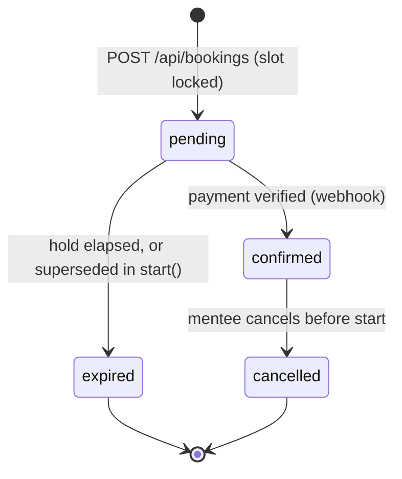

# Booking and payment (E03)

Status: active, 2026-09-14. Epic [#9](https://github.com/open-mercato/ai_techleaders_project/issues/9);
stories [#20](https://github.com/open-mercato/ai_techleaders_project/issues/20),
[#21](https://github.com/open-mercato/ai_techleaders_project/issues/21),
[#22](https://github.com/open-mercato/ai_techleaders_project/issues/22),
[#23](https://github.com/open-mercato/ai_techleaders_project/issues/23),
[#24](https://github.com/open-mercato/ai_techleaders_project/issues/24),
[#25](https://github.com/open-mercato/ai_techleaders_project/issues/25),
task [#34](https://github.com/open-mercato/ai_techleaders_project/issues/34).

This is the spec the epic and every one of its stories records as owed. It replaces the
six per-story spec names those issues proposed (`-mentor-list`, `-booking-flow`,
`-booking-notifications`, `-cancellation`, `-fee-split-and-payouts`) with one document,
because the six share one entity, one money path and one set of invariants; splitting them
would have duplicated the booking lifecycle five times and let the copies drift.

## Problem and goal

A mentor can publish a page, prices and times (E02), and a mentee can sign in (E01), but
nothing connects them: there is no way to find a bookable mentor without a share link, no
way to reserve a time, and no way to pay. The founders' current-state journey ends in
unanswered DMs and ad-hoc PayPal transfers with no rules.

The goal is the Key flow end to end: a mentee finds a mentor, reserves a slot that starts
at least two hours ahead at a 25- or 50-minute length, pays through Stripe Checkout, and
the booking becomes real only when the payment is verified. Both parties are told and see
the session. A mentee may cancel — free more than 24 hours ahead, forfeiting the fee after
that. DevMentor keeps 20% of a held session and the mentor's share is transferred through
Stripe Connect.

## Non-goals

- Search, ranking, scoring or featured placement in the mentor list (R13, N02). The list
  filters by one stack tag and orders by most recent published availability, nothing else.
- Ratings and reviews (N02). The design system ships `MentorReviews`; the list does not
  render it.
- The text session itself, the written answer and the session note (E04).
- Stripe Connect **onboarding** (E02-S05 / #19). This spec adds only the two columns a
  payout decision reads — `stripeConnectAccountId` and `payoutsEnabled` — and the hold
  branch that fires when onboarding has not happened. Nothing here creates an account link
  or talks to Connect's onboarding API.
- The operator's fee/bounds settings screen (E05-S02). The fee stays configuration-backed
  in `PlatformSettingsService`, exactly as the price bounds already are.
- Mentor-initiated cancellation (D10 speaks of the mentee only) and quality disputes
  (E05-S03).
- Any scheduler, queue or worker. There is none in this project; payouts run on demand.
- Recording a signed-in mentee's mentor-page visit (Q20, undecided).
- Any promise in copy about how soon an answer arrives (R14).

## Approach

### The booking lifecycle

One entity, `Booking`, with four states and exactly one legal transition out of each:



`pending` holds the slot for 30 minutes, which is also the Checkout session's expiry, so
the two cannot disagree about who owns the slot. A booking is `confirmed` only from the
payment webhook — never from the browser's return to `success_url`, which proves nothing.

**One active booking per slot, enforced by the database.** A partial unique index
`bookings_active_slot_unique` on `slot` `WHERE status IN ('pending','confirmed')` is the
arbiter; `expired` and `cancelled` rows fall out of it, so a slot whose hold lapsed is
bookable again and the history is kept. `start()` locks the slot row, expires a lapsed
pending booking in the same transaction, and creates the new one — so two concurrent
requests on one slot produce one `201` and one `409`, decided by PostgreSQL rather than by
a read-then-write race (engineering standards, "never split a check-then-write across two
round-trips without a transaction").

The price is never supplied by the client. `start()` reads the mentor's stored
`price25Cents` / `price50Cents` for the chosen length and snapshots it onto the booking;
the webhook refuses a Checkout whose `amount_total` differs from that snapshot (R08).

`bookedAt` (set at confirmation) and `startsAt` (copied from the slot at reservation) are
what make D22's booking-to-start median readable without joining to a mutable slot row.

### Payments behind a port

`PaymentGateway` is the only thing that knows Stripe exists:

```
createCheckoutSession({ bookingId, amountCents, currency, successUrl, cancelUrl, expiresAt }) -> { id, url }
parseWebhookEvent(rawBody, signatureHeader) -> GatewayEvent
refund({ paymentIntentId, amountCents, idempotencyKey }) -> { id, status }
transfer({ amountCents, currency, destinationAccountId, idempotencyKey, transferGroup }) -> { id }
```

`StripePaymentGateway` implements it with the pinned `stripe` SDK; `MockPaymentGateway`
implements it in memory with a `simulateCheckoutCompleted` helper, and is what every unit
test and the integration harness use. `container.ts` selects Stripe when
`STRIPE_SECRET_KEY` is present and the mock otherwise — selection from a flag that is
present, never from a credential that is absent, matching the rule `selectMailer` and
`selectGithubIdentity` already follow.

**Idempotency is a row, not a hope.** `ProcessedWebhookEvent` has a unique `eventId`;
`confirmFromWebhook` inserts it first inside the transaction, and a duplicate insert ends
the handler as a no-op. Stripe redelivers; this is what makes the second delivery free.

The webhook route is the single non-enveloped route besides `/api/health`: it reads the
raw body for signature verification, answers Stripe with a bare 2xx/4xx, and is the only
legitimate user of `apiHandler(logic, { csrf: false })` — it authenticates by signature.
`BACKWARD_COMPATIBILITY.md` §1 records the exception.

### Fee and payout

The fee is snapshotted at confirmation — `feePercentApplied`, `platformFeeCents`,
`mentorShareCents` — so changing the fee later cannot rewrite what an earlier booking owed
(R10). `platformFeeCents = round(priceCents * feePercent / 100)` and the mentor's share is
the remainder, so the two always sum to the price with no rounding leak.

A `Payout` row per booking is created by `PayoutService.runDue(now)`, which selects
confirmed, uncancelled bookings whose session has ended (`startsAt + lengthMinutes <= now`)
and that have no payout yet. With `payoutsEnabled`, it transfers through Connect and marks
`transferred`; without, it records `held` with `heldReason = 'connect_onboarding_incomplete'`
and notifies the mentor. A refunded or cancelled booking is never selected, so it yields no
fee and no payout.

**Separate transfers after completion, not destination charges at Checkout.** This is the
open question #25 asked the spec to decide. Destination charges are simpler but require a
mentor to have finished Connect onboarding *before anyone can book them*, which would make
E03 depend on E02-S05 shipping first and would silently un-list mentors who are otherwise
ready. Separate transfers let a mentor be booked immediately and paid once they onboard;
the held payout is the visible record of the gap.

Payouts run from `POST /api/operator/payouts/run` (operator only) and `npm run payouts:run`
for the founders, both logged (R18). No scheduler is introduced.

### Notifications and the two session lists

`bookings.booking.confirmed` and `bookings.booking.cancelled` join the typed event map;
`NotificationService` subscribes in `container.ts#build`. Per party it writes a durable
`Notification` row and sends one best-effort email through the existing `Mailer` port — the
event bus is in-process and swallows handler failures, so the row is the record and the
email is the courtesy. Nothing subscribes to `pending` or `expired`, so an unconfirmed
booking notifies nobody.

`GET /api/bookings` answers from the session's role — `mentee` gets bookings where they are
the mentee, `mentor` gets bookings against their own profile. **The client never sends a
user id**; there is no parameter that could be tampered with.

### UI: the design system is the source of the screens

The prototype already carries the finished design for this epic. Implementation wires the
existing components rather than inventing screens: `BookingSummary` and
`CancellationSummary` (bookings), `PaymentStatus` and `PayoutStatus` (payments),
`SessionCard`, `SessionHeader` and `NotificationItem` (sessions), `AvailabilityPicker` and
`DurationSelector` (availability), `TechnologyChips` and `MentorProfileCard` (mentors).

The public list already has its shell: `MentorDirectory` (in
`components/mentors/MentorProfileCard.tsx`) is a stack-filter, result-count and empty-slot
container whose Storybook story names #20 as its consumer, and it is deliberately not
`MentorSearch` — that one carries a search box, a price filter and a sort control, all three
of which R13 forbids.

Two components are added, because the epic needs surfaces the handoff did not draw:

- `MentorListingCard` (`ui/src/components/mentors/`) — the card the public list puts inside
  that shell. `MentorProfileCard` is the mentor's *own* profile card: it carries a
  draft/published status chip and no price, neither of which belongs in a public list.
  The new card composes the existing `MentorIdentity` and `TechnologyChips`, shows both
  prices as separate neutral fact chips, and links to the mentor page.
- `SessionIsTextNotice` (`ui/src/components/sessions/`) — the one component that says
  sessions are text and promises nothing about response time (R03, R14), rendered on every
  booking and session screen so the copy cannot drift between them.

Every added component ships a `.stories.tsx` with its states and a test file at 100%
coverage, and is exported from `packages/ui/src/index.ts`.

### Where the code goes

Three new concept folders, each repeated across the layers that need it, per the directory
convention: `bookings`, `payments`, `notifications`.

```
packages/db/src/entities/bookings/booking.entity.ts
packages/db/src/entities/payments/{processed-webhook-event,payout}.entity.ts
packages/db/src/entities/notifications/notification.entity.ts
packages/core/src/services/bookings/booking.service.ts
packages/core/src/services/payments/{payment-gateway.port,payment.service,payout.service}.ts
packages/core/src/services/payments/adapters/{mock,stripe}-payment-gateway.ts
packages/core/src/services/notifications/notification.service.ts
packages/core/src/validators/bookings/booking-create.schema.ts
packages/app/src/app/api/bookings/route.ts                       GET list, POST start
packages/app/src/app/api/bookings/[id]/checkout/route.ts         POST
packages/app/src/app/api/bookings/[id]/cancel/route.ts           POST
packages/app/src/app/api/payments/webhook/route.ts               POST, raw body, no envelope
packages/app/src/app/api/notifications/route.ts                  GET, POST mark read
packages/app/src/app/api/mentors/route.ts                        GET list
packages/app/src/app/api/operator/payouts/run/route.ts           POST
packages/app/src/app/mentors/page.tsx                            public list
packages/app/src/app/(mentee)/sessions/page.tsx
packages/app/src/app/(mentor)/mentor/sessions/page.tsx
packages/app/src/app/(mentor)/mentor/payouts/page.tsx
```

### Configuration

`STRIPE_SECRET_KEY`, `STRIPE_WEBHOOK_SECRET` and `PLATFORM_FEE_PERCENT` join the zod env
schema. The two Stripe keys are optional and fail closed at the point of use, so a
development process without them boots and serves every page while refusing to start a
Checkout; `PLATFORM_FEE_PERCENT` defaults to 20 (D11/R10). `.env.example`, the CI workflow
and `tests/integration/environment.ts` carry them.

## Acceptance criteria

Taken verbatim from the six stories; each is covered by a unit test and, where it crosses
a boundary, an integration scenario.

**E03-S01 — the list (#20)**
1. Published mentors with at least one future slot and both prices appear, most recently
   published availability first.
2. Filtering by a stack tag leaves only mentors carrying that tag.
3. The list renders no search box, no score, no rating and no featured placement.
4. A mentor with no published slot, or without both prices, is not listed.

**E03-S02 — picking (#21)**
5. A signed-in mentee picking a slot at least two hours ahead chooses 25 or 50 minutes and
   sees the mentor's price for that length before paying.
6. A slot starting in under two hours is not bookable and the screen says why.
7. A signed-out visitor picking a slot is asked to sign in and returns to the same slot.
8. Every booking screen says the session is text and promises nothing about timing.
9. A slot already taken is refused for a second mentee.

**E03-S03 — paying (#22, #34)**
10. Paying in Checkout confirms the booking, takes the slot, and shows it to both parties.
11. An abandoned Checkout leaves no booking and the slot free.
12. A confirmation delivered twice yields one booking and one recorded charge.
13. A confirmed booking stores booked-at and the slot's start, so booking-to-start is
    readable for D22.
14. The amount charged equals the mentor's price for the chosen length.
15. A confirmed booking counts once as a paid session for D16.
16. A bad signature is refused with 400 and changes nothing; a mismatched amount is refused
    and flagged; a gateway failure leaves the booking pending.

**E03-S04 — telling both parties (#23)**
17. On confirmation the mentor is told in the product and by email with start, length and
    the mentee's name; the mentee is told the same.
18. A mentee's sessions list shows upcoming and past with start, length, mentor and status.
19. A mentor's list contains only sessions booked with them.
20. A booking that was never confirmed sends nothing.

**E03-S05 — cancelling (#24)**
21. Cancelling more than 24 hours ahead frees the slot and refunds in full through Stripe.
22. Cancelling inside 24 hours frees the slot and refunds nothing, and the confirmation
    screen said so before the mentee confirmed.
23. The mentor sees a cancelled booking with its refund state.
24. Cancelling a started session is refused and points to a quality dispute.

**E03-S06 — the split (#25)**
25. A held session records 20% as the platform fee and the rest as the mentor's share.
26. With Connect onboarding complete, the share is transferred through Connect and nothing
    else.
27. Without onboarding the payout is held and the mentor is told.
28. A fee change applies to later sessions and not to earlier ones.
29. A refunded session takes no fee.

## Risks and open questions carried

- **Q19 — first-iteration payouts** (founder A with founder B) stays open. This spec makes
  the held payout the visible record of an unpaid mentor, which is what a by-hand decision
  needs; it does not decide the policy.
- **Q20 — mentor-page visit recording** stays open and unimplemented (D17's check).
- Which week a paid session counts in for D16 (booking week or start week) is undecided;
  `paidSessionsPerWeek` groups by `bookedAt` and says so, and the other grouping is a
  one-line change if founder A decides otherwise.
- A real mail transport is still owed before October (E01-S02's follow-up). Until then the
  log mailer carries the notification emails in development, and the durable `Notification`
  row is what the product actually relies on.
- Money paths carry `risk-high`: a second reviewer and manual QA are required by `SDLC.md`,
  and self-QA is not accepted for E03-S03, E03-S05 or E03-S06.
