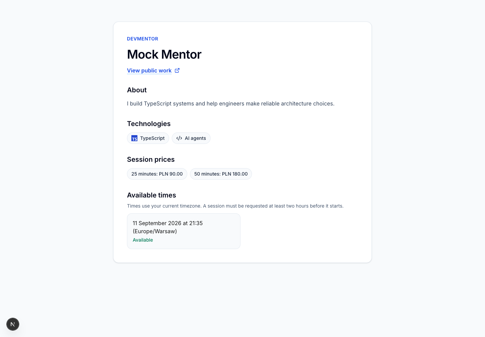
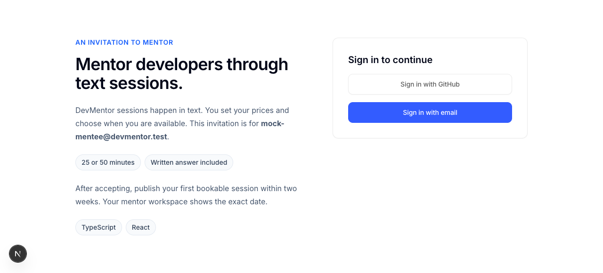
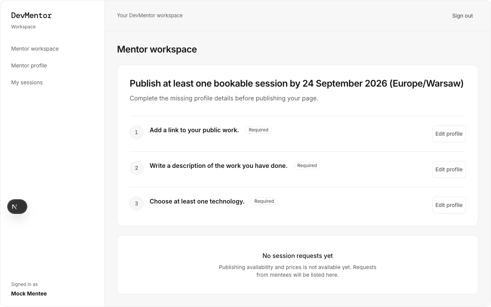
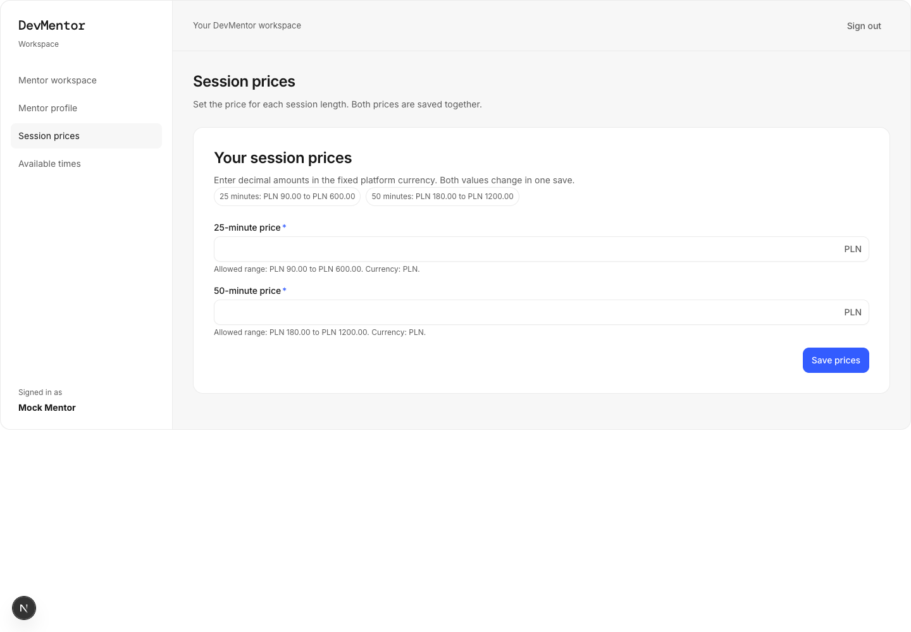
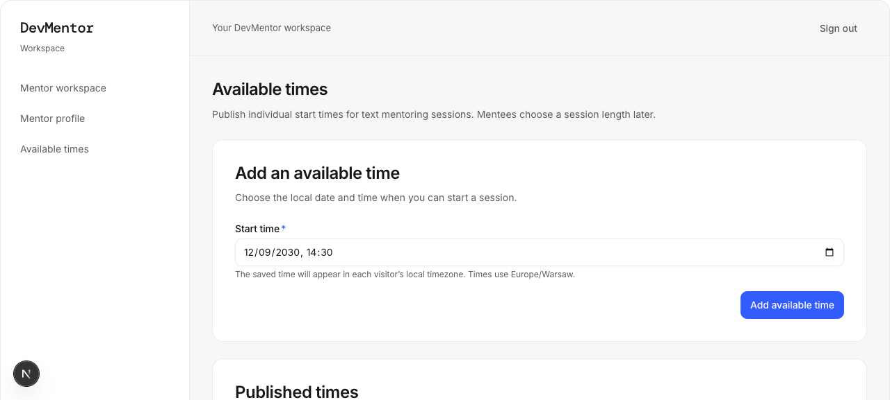
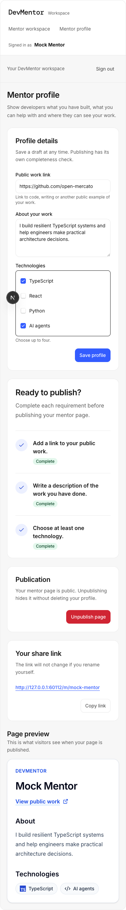

<div align="center">

# ⚡ DevMentor

### 🧠 Senior engineers, bookable by the half hour

**Stuck the day before a release, with the only senior on leave?**
DevMentor puts a hand-picked expert in a paid 25- or 50-minute text session and leaves
you with a written answer you keep.

[](https://nextjs.org)
[](https://react.dev)
[](https://www.typescriptlang.org)
[](https://www.postgresql.org)
[](https://nodejs.org)
[](./docs/DEVELOPMENT.md#testing-and-pull-request-checks)

[**💡 Why**](#-why-devmentor) &nbsp;&nbsp; [**🎯 Who it's for**](#-who-its-for) &nbsp;&nbsp; [**✨ Features**](#-what-it-does-today) &nbsp;&nbsp; [**🚀 Getting started**](#-getting-started) &nbsp;&nbsp; [**📚 Docs**](#-documentation) &nbsp;&nbsp; [**🤝 Contributing**](#-contributing)



</div>

---

## 💡 Why DevMentor

A developer hits a problem the day before a release. The team's only senior is on
leave. Forty minutes go into Stack Overflow, a Discord gives two contradictory answers,
and a workaround ships with a TODO nobody trusts. *"Half a day, and I still don't trust
that code."*

On the other side of the same market sits a senior engineer answering the same three
questions every month in DMs and a community Slack, unpaid, pasting from a private
notes file. *"Two evenings a month, for free, and the notes rot."*

Courses do not fix this, and neither does another chat channel. **A named expert
looking at your actual code, inside the hour you have** is what is missing, and it is
what DevMentor sells.

### 💰 The model in one line

The mentee pays the mentor's own price at booking. **DevMentor keeps 20%**, the mentor
receives the rest, and both sides keep a written note of what was decided. Supply is
invited rather than open — hand-picked seniors in TypeScript, React, Python and AI
agents — so the first mentor a developer meets is a good one.

| | Today, without it | With DevMentor |
| --- | --- | --- |
| 🧑‍💻 **Mentee** | Hours of searching, contradictory answers, a workaround you do not trust | One expert, one price, one written answer that outlives the session |
| 🧑‍🏫 **Mentor** | The same questions answered free, in DMs, at night | Published prices and times, paid sessions, a note that stays theirs |
| 🏢 **Operator** | — | A marketplace with invited supply, price bounds, and a 20% platform fee |

> 📌 Mentors bring their own audience through a share link, so supply and demand arrive
> together. Every number above — the fee, the bounds, the session lengths, the invite
> batches — is a recorded decision in
> [`.ai/specs/product-brief.md`](./.ai/specs/product-brief.md).

## 🎯 Who it's for

<table>
<tr>
<td width="33%" valign="top">

### 🧑‍💻 The blocked developer

*"I don't want a course, I want an answer."*

Opens a mentor's page, sees the price and the next free time, books a 25- or 50-minute
text session, and leaves with a written answer.

</td>
<td width="33%" valign="top">

### 🧑‍🏫 The senior who mentors anyway

*"The notes should earn something without me being on a call."*

Accepts an invitation, publishes a profile with a share link, sets prices inside the
platform bounds, and opens only the times that suit them.

</td>
<td width="33%" valign="top">

### 🏢 The two-person operator

Runs the marketplace, by hand where a screen does not exist yet: invitations in batches
of 20, the price bounds, the fee, and any dispute.

</td>
</tr>
</table>

**The moments the product is built around**

- 🔥 **Release-day blocker** — a generics error, a failing migration, an agent
  misconfigured. Book the next slot and get an expert on it.
- 🏗️ **An architecture call with nobody to check it** — buy 50 focused minutes from
  someone who has shipped it before instead of guessing for a week.
- 📣 **A mentor with an audience** — share your DevMentor link on your own channels and
  turn "can I pick your brain?" into scheduled, paid work.
- 🧾 **Knowledge that survives the call** — the mentor drafts a note, the mentee
  approves or declines it, and nothing is ever published without the mentee's say-so.

## ✨ What it does today

Everything below runs on `master` and is covered by unit and browser tests. The
screenshots are real captures from those test runs.

### 📨 Invite-only mentor onboarding

Invitations are single-use, expiring links. Accepting one turns a GitHub or email
account into a mentor and starts a two-week clock to publish something bookable.



### 🧭 A workspace that says exactly what is missing

The mentor workspace names the publish deadline and lists the requirements still open,
each with a direct link to the field that clears it.



### 💸 Prices the mentor sets, inside bounds the operator sets

The 25- and 50-minute prices save together in the fixed platform currency, and the
allowed range is on screen before anything is typed.



### 🗓️ Availability in the visitor's own timezone

A mentor publishes individual start times; every visitor sees them in their own
timezone, and a session must be requested at least two hours before it starts.



### 📱 Built for a phone, not only a laptop

The profile editor, the completeness checks, the share link and the live preview of the
public page all work down to a 320-pixel screen.

<details>
<summary><b>📸 See the mentor profile editor on mobile</b></summary>
<br>

</details>

### 🔐 And underneath

- **Accounts and roles** — sign in with GitHub or with email and password, with email
  verification, route guards, and rate limiting per IP and per address.
- **A public mentor page** at `/m/<slug>` with a share link the mentor owns, and an
  unpublish that hides the page without deleting anything.
- **An operator surface** at `/admin`, reading through the same DI container as the
  rest of the app.
- **Boots without a database** — DB-backed pages degrade to a visible "unavailable"
  state instead of crashing, and `/api/health` reports both.

### 🚧 In review right now

Booking, Stripe payment and the text session itself are open pull requests rather than
`master` — see the [changelog](./CHANGELOG.md) and the repository's open PRs for where
they stand.

## 🚀 Getting started

Requires **Node ≥ 24**; Docker is optional. Run `npm install && npm run setup && npm run dev`
and open <http://localhost:3000> — `npm run setup` is idempotent and does the whole job
(installs the workspaces, writes `.env` from `.env.example`, reuses any PostgreSQL
already listening and falls back to Docker Compose only when nothing answers, applies
migrations, seeds the demo personas), reporting each step as `ran` or `skipped`. Sign in
with email as `mock-mentee@devmentor.test`, or as `mock-operator@devmentor.test` to
reach `/admin`, using the published demo password in
`packages/db/src/seeders/seed-password.ts`; a mentor reaches the workspace at `/mentor`,
and a public page appears at `/m/<slug>` once that mentor publishes one. Everything else
— configuration variables, bring-your-own-PostgreSQL, manual setup, GitHub OAuth, the
script table, tests and architecture — is in the
**[development guide](./docs/DEVELOPMENT.md)**.

```bash
npm install
npm run setup
npm run dev
```

## 📚 Documentation

| Document | What's in it |
| --- | --- |
| [docs/DEVELOPMENT.md](./docs/DEVELOPMENT.md) | Setup, configuration, scripts, testing, architecture |
| [AGENTS.md](./AGENTS.md) | The stack, the conventions, and the gotchas that cost us time |
| [SDLC.md](./SDLC.md) | How a change travels from ticket to merge |
| [CODE_REVIEW.md](./CODE_REVIEW.md) | The checklist every pull request is read against |
| [BACKWARD_COMPATIBILITY.md](./BACKWARD_COMPATIBILITY.md) | What counts as a breaking change here |
| [CHANGELOG.md](./CHANGELOG.md) | What shipped, release by release |
| [.ai/specs/](./.ai/specs/) | The product brief and the spec behind each feature |

## 🤝 Contributing

Contributions are welcome, from a typo fix to a whole epic.

1. **📝 Start from a spec.** Anything beyond a small, obvious change is written down
   first. Look in [`.ai/specs/`](./.ai/specs/) for one that already covers your idea,
   and write one if it does not.
2. **🌿 Branch and build.** Work on a `feat/…` or `fix/…` branch. Every code change
   ships with unit tests: coverage is enforced at **100%** per file for statements,
   branches, functions and lines on everything listed in `vitest.config.mts`.
3. **✅ Run the gate before you push.**

   ```bash
   npm run typecheck && npm run lint && npm run test && npm run build
   ```

4. **🔍 Open a pull request against `master`.** Build, Lint, Unit tests and Integration
   tests run independently; a reviewer reads the diff against
   [CODE_REVIEW.md](./CODE_REVIEW.md), and user-facing changes wait for manual QA.
5. **🎓 Leave the lesson behind.** Fixed a nontrivial bug or hit a project-specific
   gotcha? Add a line to [`.ai/lessons.md`](./.ai/lessons.md) so the next contributor,
   human or agent, does not repeat it.

The full process, including how autonomous agent runs fit into it, is in
[SDLC.md](./SDLC.md); the conventions those runs follow are in
[AGENTS.md](./AGENTS.md).

## 📄 License

**No license has been granted yet.** There is no `LICENSE` file and the root
`package.json` is marked `private`, so ordinary copyright applies: the code is readable
here, but it is not yet licensed for reuse, modification or redistribution.

If you want DevMentor for anything beyond reading it and contributing back, open an
issue and ask. Choosing a license (MIT and Apache-2.0 being the obvious candidates)
belongs to the repository owner, and adding the file is a two-minute change once that
call is made.

---

<div align="center">

Built with Next.js, TypeScript and PostgreSQL

Specs, run logs and lessons live in [`.ai/`](./.ai)

</div>
